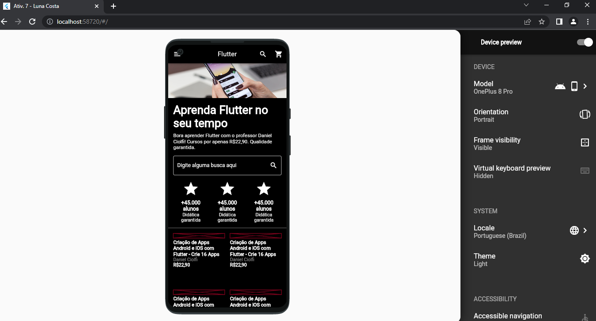
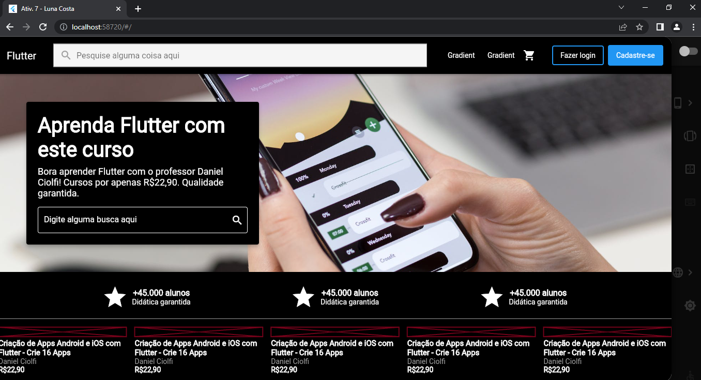
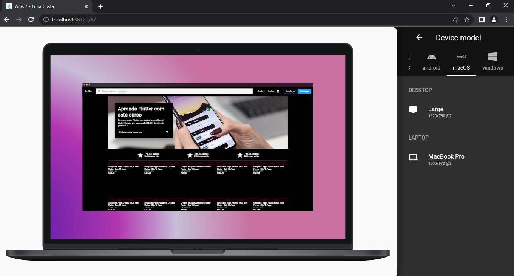

# Exemplo 1 - Avaliação 7

## 📚 Descrição do projeto
- Projeto Responsivo funcionando do Exemplo 1 da Atividade 7
- Abaixo seguem alguns screenshots do projeto funcionando e um vídeo também mostrando o mesmo:

## ✒️ Autora
**Luna Costa Vasconcelos** - [github](https://github.com/luna-vasconcelos)
