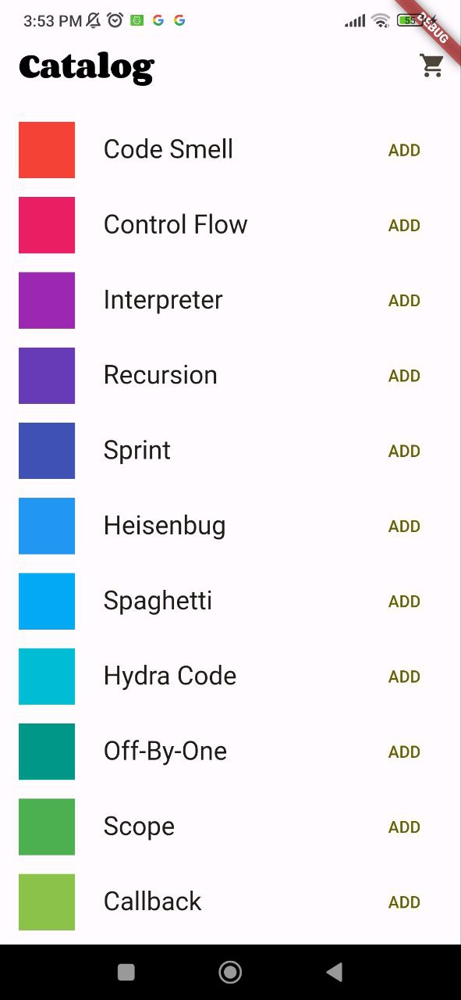

# Avaliação 9

## 📚 Descrição do projeto
- Projeto da Atividade 9
- Abaixo seguem alguns screenshots dos dois projeto funcionando:

- provider_counter:
  - Funcionamento no vscode:

  - Projeto funcionando no meu celular (M2004J19C):

- provider_shopper:
  - Funcionamento no vscode:

  - Projeto funcionando no meu celular (M2004J19C):

