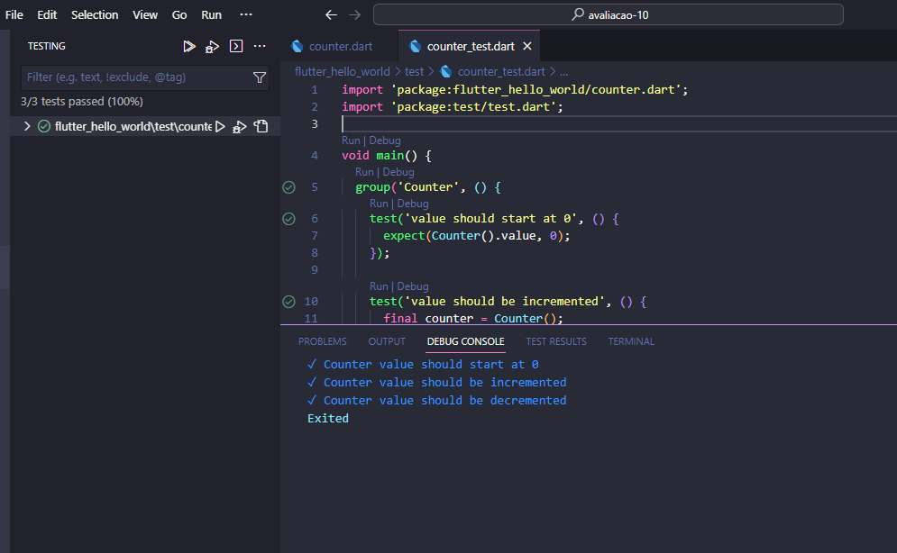

# Avaliação 10

## 📚 Descrição do projeto
- Projeto mostrando a implementação e execução de testes unitários para a Atividade 10
- O código para os testes pode ser encontrado em test/counter_test.dart
- Abaixo seguem alguns prints do projeto funcionando e os testes passando:

- Print dos testes implementados funcionando e passando:

